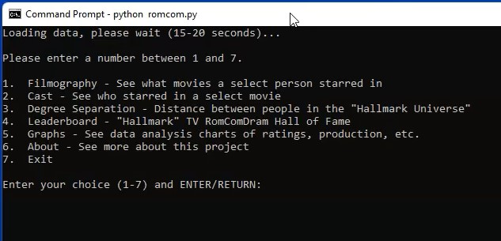
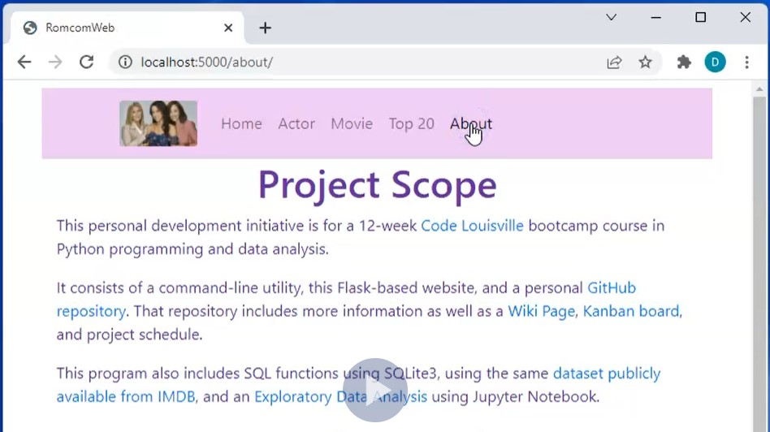

# OVERVIEW
Is Lacey Chabert indeed the "Center of the (Hallmark) Universe," as Kevin Bacon reputably is to Hollywood? This project addresses that proposition, using a [subset of IMDB listed movies](https://github.com/hellums/lacey-bacon/blob/root/watchlist.txt) and actors from Hallmark original movies, romantic comedies, mysteries, and dramas.  

This repo is the result of a [Code Louisville](https://www.codelouisville.org/) course on Python programming and data analysis. All images and websites shown here belong to the original copyright holders and are used for academic and demonstration purposes only. Source and derived data is [publicly available and courtesy of IMDB](https://www.imdb.com/interfaces/).

# COMMAND-LINE WALKTHROUGH VIDEO

# GOALS
- Satisfy the 4+ minimum requirements of the bootcamp assignment in the syllabus (one from each category)
- Satisfy as many optional and "stretch" requirements and enhancements as possible

# BASIC FUNCTIONALITY (Code Louisville Project)

## Mac/Linux instructions for command-line version:
(NOTE: Requires python version 3 and pip. The series of commands below will download the app, create a virtual environment, install python, pip, and the app's prerequisites in that virtual environment, and run the app using recently compiled data. 
  - >git clone https://github.com/hellums/lacey-bacon.git
  - >cd lacey-bacon
  - >python -m venv env
  - >source env/bin/activate
  - >pip install -r requirements.txt
  - >python romcom.py

## Windows instructions for command-line version:
If using VSC, a DOS command prompt terminal is highly recommended, NOT PowerShell.

Perform same steps as above, except replace the "source env/bin/activate" command in step 4 with 
  - >env\Scripts\activate (or activate.bat)

## To view Jupyter Notebook output and data analysis
- [Notebook/EDA](https://github.com/hellums/lacey-bacon/blob/root/romcomEDA.ipynb)
(or open romcomEDA.pdf in the project folder using Adobe or other PDF viewer)

## To run a few unit tests for data integrity
To test functions and data:
  - >python -m unittest test_romcom -v

To test SQLite3 database:
  - >python romcomSQL.py

# Satisfaction of Code Louisville Requirements
Requirements are called out in code, just search for "Code Louisville" in the python files (romcom, romcomPrep, testRomcom, romcomSQL)

Category 1 - Python Programming Basics
- [x] Implement a [“master loop”](https://github.com/hellums/lacey-bacon/blob/322b40ad14db8751f4f363e50f25264d0bbef806/romcom.py#L34) console application where the user can repeatedly enter commands/perform actions, including choosing to exit the program. 
- [x] [Create a class](https://github.com/hellums/lacey-bacon/blob/322b40ad14db8751f4f363e50f25264d0bbef806/romcomClass.py#L9), then [create at least one object of that class and populate it with data](https://github.com/hellums/lacey-bacon/blob/322b40ad14db8751f4f363e50f25264d0bbef806/romcomClass.py#L97). The value of at least [one object must be used somewhere in your code](https://github.com/hellums/lacey-bacon/blob/322b40ad14db8751f4f363e50f25264d0bbef806/romcomClass.py#L158). Implemented in optional, class-based version of CLI program (romcomClass.py).
- [x] Create a dictionary or list, populate it with several values, retrieve at least one value, and [use it in your program](https://github.com/hellums/lacey-bacon/blob/322b40ad14db8751f4f363e50f25264d0bbef806/romcom.py#L118).
- [x] Create and call at least [3 functions or methods](https://github.com/hellums/lacey-bacon/blob/322b40ad14db8751f4f363e50f25264d0bbef806/romcom.py#L114), at least one of which must [return a value](https://github.com/hellums/lacey-bacon/blob/322b40ad14db8751f4f363e50f25264d0bbef806/romcom.py#L357) that is used somewhere else in your code.

Category 2 - Utilize External Data
- [x] [Read data from an external file](https://github.com/hellums/lacey-bacon/blob/322b40ad14db8751f4f363e50f25264d0bbef806/romcom.py#L284), such as text, JSON, CSV, etc, and use that data in your application.
- [x] [Connect to a database](https://github.com/hellums/lacey-bacon/blob/322b40ad14db8751f4f363e50f25264d0bbef806/romcom.py#L350) and read data using SQL.

Category 3 - Data Display
- [x] Visualize data in a [graph](https://github.com/hellums/lacey-bacon/blob/322b40ad14db8751f4f363e50f25264d0bbef806/romcomPrep.py#L192), chart, or other [visual representation of data](https://github.com/hellums/lacey-bacon/blob/322b40ad14db8751f4f363e50f25264d0bbef806/romcom.py#L234).

Category 4 - Best Practices
- [x] The program should utilize a virtual environment and document library dependencies in a [requirements.txt file](https://github.com/hellums/lacey-bacon/blob/322b40ad14db8751f4f363e50f25264d0bbef806/requirements.txt#L1).
- [x] Create 3 or more [unit tests](https://github.com/hellums/lacey-bacon/blob/322b40ad14db8751f4f363e50f25264d0bbef806/test_romcom.py#L12) for your application.

"Stretch" list:

- [x] Use [pandas, matplotlib,](romcomEDA.ipynb) and/or numpy to perform a data analysis project. [Ingest 2 or more pieces of data](https://github.com/hellums/lacey-bacon/blob/07afe2e2fdc379da54b68740b878b2e313314354/romcomPrep.py#L30), analyze that data in some manner, and [display a new result to a graph, chart, or other display](https://github.com/hellums/lacey-bacon/wiki/Data-Analytics-Course-Project).
- [x] Use a [Jupyter notebook](romcomEDA.ipynb) to document your data analysis.

# EXTENDED FUNCTIONALITY (Not Part of Code Louisville submission)

# Project-Related Github Pages
- [Kanban board](https://github.com/hellums/lacey-bacon/projects/1) for managing project schedule
- [Issues](https://github.com/hellums/lacey-bacon/issues) for incident management
- [Wiki](https://github.com/hellums/lacey-bacon/wiki/Data-Analytics-Course-Project) for related project links and information

# To see a version of the CLI program that uses OOP, classes, and methods:
  - >python romcomClass.py

## FLASK WEB WALKTHROUGH VIDEO

## To Launch the Flask Web Server and RomCom Web Client:
  - >python romcomWeb.py
  - >in a web browser tab, go to http://localhost:5000/ 

## FLASK API SCREENSHOT

## To Launch the Flask API Server and RomCom API Client:
- >python romcomAPI.py
  - >in a web browser tab, http://localhost:8080/actors will return top 10 actors in JSON simple list format    
  - >http://localhost:8080/movies will return the top 10 movies in JSON simple list format
  - >http://localhost:8080/rating/?tt=tt13831504 will return the rating of "It Was Always You" (IMDB title code tt13831504) as JSON list 

## Database Refresh
To perform a full download of the current IMDB source files, and initialize or rebuild data structures (NOTE: requires 6 GB space, 3-5 minute compile time):
  - >python romcomPrep.py 

## Clean Up
- To get everything back to normal and remove files, type deactivate, then remove the lacey-bacon directory. Your system will be back to normal, as before the test.

